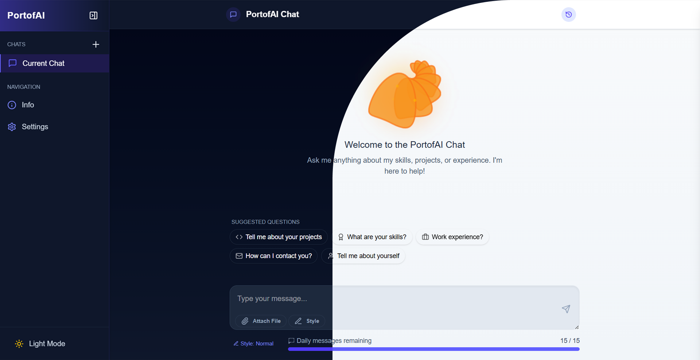

# PortofAI: Your AI Portfolio Assistant 🤖✨

<div align="center">

[](https://nextjs.org/)
[](https://reactjs.org/)
[](https://tailwindcss.com/)
[](https://www.framer.com/motion/)
[](https://vercel.com/)
[](https://www.docker.com/)



**An intelligent conversational interface to learn about me and my work in real-time, with data directly from GitHub.**

[Live Demo](#) • [Features](#-key-features) • [Tech Stack](#-tech-stack) • [Installation](#-installation) • [Screenshots](#-screenshots)

</div>

---

## 📖 Overview

PortofAI revolutionizes the traditional portfolio experience with an AI-powered chat interface that provides real-time information about my skills, projects, and experience. Instead of navigating through static pages, visitors can simply ask questions and receive immediate, contextually relevant answers about my work and capabilities.

The application directly integrates with my GitHub repositories to ensure all information remains current and accurate, offering a dynamic and engaging way to explore my professional background.

---

## ✨ Key Features

<div align="center">
<table>
  <tr>
    <td align="center"><b>💬</b></td>
    <td><b>Interactive Chat</b></td>
    <td>Real-time typing animations, rich text formatting, and natural conversation flow</td>
  </tr>
  <tr>
    <td align="center"><b>🔄</b></td>
    <td><b>GitHub Integration</b></td>
    <td>Live data from repositories ensures information is always current</td>
  </tr>
  <tr>
    <td align="center"><b>🌓</b></td>
    <td><b>Theme Switching</b></td>
    <td>Seamless light and dark mode with persistent user preferences</td>
  </tr>
  <tr>
    <td align="center"><b>📱</b></td>
    <td><b>Responsive Design</b></td>
    <td>Optimized experience across mobile, tablet, and desktop devices</td>
  </tr>
  <tr>
    <td align="center"><b>🧠</b></td>
    <td><b>Multiple AI Styles</b></td>
    <td>Choose from formal, explanatory, or conversational response styles</td>
  </tr>
</table>
</div>

### 💬 Conversational UI

- **Streaming Responses** - Watch AI responses appear in real-time with realistic typing animations
- **Rich Text Formatting** - Support for markdown, code blocks, links, and email formatting
- **Smart Suggestions** - Quick-access chips for common questions about projects, skills, and experience
- **Conversation History** - Persistent chat history with local storage integration

### 🎨 Premium UX/UI

- **Custom Theme Components** - Tailored scrollbars, animations, and interactive elements
- **Framer Motion Animations** - Smooth transitions and micro-interactions throughout
- **Contact Form Integration** - Built-in contact functionality with social media links
- **Accessibility Focus** - Designed with keyboard navigation and screen reader compatibility

---

## 🛠️ Tech Stack

<div align="center">
<table>
  <tr>
    <th>Category</th>
    <th>Technologies</th>
  </tr>
  <tr>
    <td><b>Frontend Framework</b></td>
    <td>Next.js 15.3.1 (App Router) • React 19.0.0</td>
  </tr>
  <tr>
    <td><b>Styling</b></td>
    <td>Tailwind CSS 4 • Custom CSS • CSS Variables</td>
  </tr>
  <tr>
    <td><b>Animation & UI</b></td>
    <td>Framer Motion • Lucide React (Icons)</td>
  </tr>
  <tr>
    <td><b>State Management</b></td>
    <td>React Hooks • Context API • Local Storage</td>
  </tr>
  <tr>
    <td><b>Development</b></td>
    <td>ESLint • Docker • Git</td>
  </tr>
  <tr>
    <td><b>Deployment</b></td>
    <td>Vercel</td>
  </tr>
</table>
</div>

---

## 📦 Project Structure

```
src/
├── app/                  # Next.js App Router pages
│   ├── page.js           # Home page with main chat interface
│   ├── info/             # Info page with project details
│   ├── settings/         # Settings page
│   ├── globals.css       # Global styles
│   └── layout.js         # Root layout component
│
├── components/           # React components
│   ├── screen/           # Chat interface components
│   │   ├── ChatInterface.js       # Main chat container
│   │   ├── ChatMessage.js         # Message display component
│   │   ├── StreamingBubble.js     # Real-time typing component
│   │   └── Format/                # Message formatting utilities
│   │
│   ├── shared/           # Reusable UI components
│   │   ├── Sidebar.js             # Navigation sidebar
│   │   ├── LogoSvg.js             # Logo component
│   │   ├── LogoAnimationSvg.js    # Animated logo component
│   │   └── Modal.js               # Modal dialog component
│   │
│   ├── info/             # Information page components
│   └── settings/         # Settings components
│
└── lib/                  # Utility functions and hooks
    └── utils/
        ├── context/      # React context providers
        ├── hooks/        # Custom React hooks
        ├── textCleaners.js      # Text processing utilities
        └── urlDetector.js       # URL detection and formatting
```

---

## 🚀 Installation

### Prerequisites

- Node.js 18.0.0 or higher
- npm or yarn package manager
- Docker (optional, for containerized deployment)

### Local Development

```bash
# Clone the repository
git clone https://github.com/yourusername/portofai.git
cd portofai

# Install dependencies
npm install

# Run the development server
npm run dev
```

Visit `http://localhost:3000` to see the application.

### Docker Deployment

```bash
# Build the Docker image
docker build -t portofai:latest .

# Run the container
docker run -p 3000:3000 portofai:latest
```

---

## 🎨 Design Resources

### Canva Design Assets

This project utilizes [Canva](https://www.canva.com/) for creating various visual assets:

- **Logo Design**: The PortofAI logo was created using Canva's graphic design tools
- **Social Media Banners**: Promotional images for sharing on platforms like Twitter and LinkedIn
- **Documentation Graphics**: Visual aids used throughout this documentation
- **Presentation Deck**: For pitching and presenting the project

<div align="center">
  
</div>

#### Design System

The Canva design system uses these primary colors, matching our application theme:

- Primary: `#6366F1` (Indigo 500)
- Secondary: `#F7941D` (Orange 500)
- Background Light: `#F8FAFC` (Slate 50)
- Background Dark: `#0F172A` (Slate 900)
- Accent: `#A855F7` (Purple 500)

---

## 📸 Screenshots

<div align="center">
  
  
  
  
</div>

---

## 🔮 Future Enhancements

- **Voice Interaction**: Add speech-to-text and text-to-speech capabilities
- **Project Visualization**: Interactive charts and diagrams for project statistics
- **Multilingual Support**: Chat in multiple languages
- **Enhanced Analytics**: Track visitor interactions and popular questions
- **File Sharing**: Support for document uploads and sharing

---

## 📄 License

This project is licensed under the MIT License - see the [LICENSE](LICENSE) file for details.

---

<div align="center">
  
### 👋 Connect With Me

[](https://github.com/RazvanBordinc)
[](https://linkedin.com/in/valentin-r%C4%83zvan-bord%C3%AEnc-30686a298/)
[](mailto:razvan.bordinc@yahoo.com)

</div>
